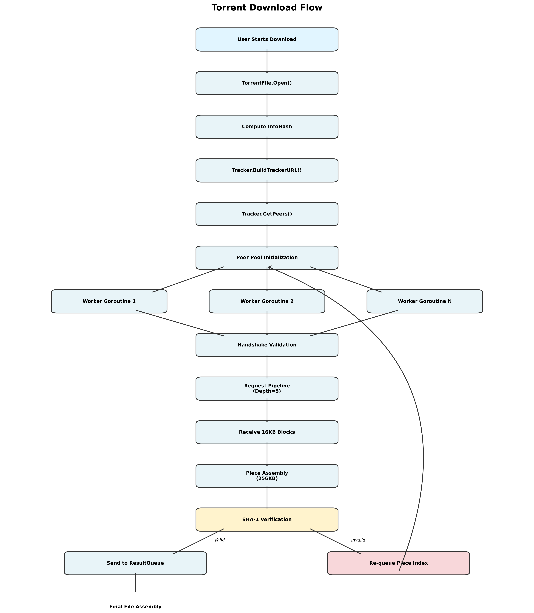

# 🛰️ Go-Torrent: High-Performance P2P Engine Specification

This repository contains a from-scratch implementation of the BitTorrent
v1.0 Protocol (BEP-0003). This is a distributed systems project that
solves the problem of file distribution without a central server by
utilizing a Non-Blocking Concurrent Worker Pool.

------------------------------------------------------------------------

# 🏗️ System Architecture Diagram

------------------------------------------------------------------------

## 🏛️ 1. Distributed Systems Architecture

The architecture is designed to handle the "Slow Peer Problem"---where
the overall download speed shouldn't be limited by the slowest
participant in the swarm. We use a Producer-Consumer model where a
single orchestrator manages a pool of independent workers.

------------------------------------------------------------------------

## 🛠️ 2. Reflection-Based Bencode Parser

The .torrent file uses Bencode, a binary-safe format. We implemented a
parser using Go Struct Tags (e.g., `bencode:"info"`). This allows the
engine to map raw binary Bencode keys directly to Go types (`int`,
`string`, `list`) in a single pass, ensuring that the 20-byte binary
InfoHash is never corrupted by UTF-8 string conversions.

------------------------------------------------------------------------

## 🔑 3. Immutable InfoHash Fingerprinting

The "InfoHash" is the SHA-1 hash of the Bencoded info dictionary. This
serves as the global identifier for the torrent. Even a 1-bit change in
the filename or piece length will result in a completely different
InfoHash, effectively placing the client in a different swarm.

------------------------------------------------------------------------

## 📡 4. Binary-Encoded Swarm Discovery (Tracker Protocol)

To find peers, we communicate with an HTTP Tracker. This requires custom
URL Encoding for the 20-byte binary InfoHash (converting hex to %XX
format). We also support BEP-0023 (Compact Mode), where the tracker
returns peers in a 6-byte binary "blob"---4 bytes for the IPv4 address
and 2 bytes for the Port (read in Big-Endian).

------------------------------------------------------------------------

## 🤝 5. The 68-Byte Binary Handshake

The very first exchange between peers is a fixed-length 68-byte message.
It verifies the protocol string ("BitTorrent protocol"), the InfoHash,
and the PeerID. Our client validates the incoming hash against our local
hash; if they don't match, the connection is dropped immediately to
prevent data poisoning.

------------------------------------------------------------------------

## 🔄 6. Protocol State Machine (Choke/Unchoke)

BitTorrent communication is a sequence of binary states. For every peer,
we maintain four boolean flags: Choked, Unchoked, Interested, and Not
Interested. We immediately signal "Interested" and only begin the
download loop once the remote peer sends an "Unchoke" message.

------------------------------------------------------------------------

## 📈 7. High-Velocity Request Pipelining

To overcome network latency (RTT), we maintain a Pipeline Depth of 5.
Instead of waiting for one 16KB block to arrive before asking for the
next, the worker dispatches 5 requests immediately. As each block
arrives, the next is fired, ensuring the peer's upload buffer is never
empty.

------------------------------------------------------------------------

## 🛡️ 8. Cryptographic Integrity Guard (SHA-1)

In a P2P swarm, we assume every peer is a potential "liar." Once all
16KB blocks for a 256KB piece are collected, we calculate
`sha1.Sum(data)` and compare it against the "Golden Hash" from the
.torrent file. If they don't match, the data is deleted, and the piece
is re-queued.

------------------------------------------------------------------------

## 🧩 9. Data Granularity Hierarchy (Pieces vs. Blocks)

The engine manages data at two distinct levels:

**Piece:** The unit of verification (e.g., 256KB). Hashes are only
checked at the piece level.

**Block:** The unit of transmission (16KB). This is the size of the
payloads sent over TCP to avoid fragmenting network packets.

------------------------------------------------------------------------

## 🧵 10. Non-Blocking Concurrency (Goroutines & Channels)

Each peer is assigned its own Goroutine. Workers are isolated; if one
peer is located in a slow network, it doesn't block other workers. We
use thread-safe Channels for the WorkQueue and ResultQueue, ensuring
zero data races during the download.

------------------------------------------------------------------------

## 🛑 11. Resilient Failover & Re-queueing

Our client implements a "Stateless Worker" logic. Workers pull a piece
index from the WorkQueue, and if the connection resets or the hash check
fails, the worker pushes the piece index back into the channel. This
ensures that healthy peers eventually pick up the slack of failing ones.

------------------------------------------------------------------------

## 🔢 12. Big-Endian Binary Logic

BitTorrent is a network-layer protocol, meaning it requires Big-Endian
(Network Byte Order) for all integers. We use the `encoding/binary`
package to ensure every 4-byte length prefix and 12-byte request payload
is correctly formatted for cross-platform compatibility.

------------------------------------------------------------------------

# Functional Map Summary

  ---------------------------------------------------------------------------
  Package       Key Functions             Role
  ------------- ------------------------- -----------------------------------
  torrentfile   Open, Download, InfoHash  Metadata parsing and global
                                          orchestration.

  peer          ReadMessage, Serialize,   Binary wire protocol and TCP stream
                Unmarshal                 management.

  tracker       BuildTrackerURL, GetPeers Swarm discovery and HTTP
                                          negotiation.
  ---------------------------------------------------------------------------

------------------------------------------------------------------------

Would you like me to show you how to implement the final step: writing
these verified pieces directly to your SSD so we can clear them from
your RAM?
